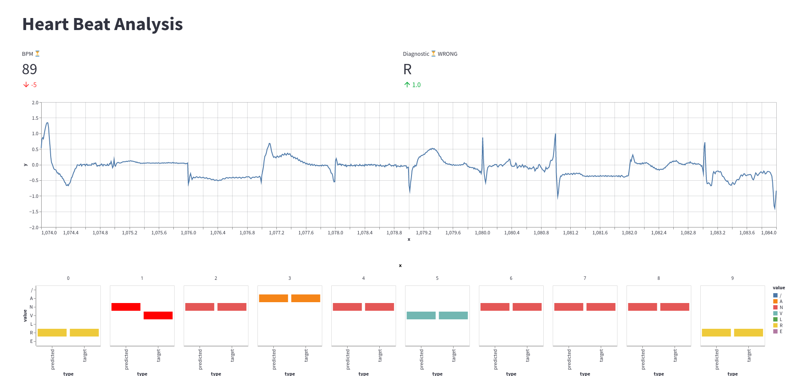

# streamlit-ecg

A simple Streamlit app that classifies heartbeats in order to detect Arrhythmia.



## Description

This app is based on the "MIT-BIH Arrhythmia Database" dataset avaiable on Physionet and is able to :

* Download the full dataset
* Extract the records and the beats
* Train a SVC model
* Show the prediction in a web app

## Create your .env file

All your settings are stored in that file. Please create a new `.env` file in the `root` folder and edit your variables.

Here is an example of the `.env` file :

```python
#Path
DB_PATH="data/mit-bih-arrhythmia-database-1.0.0"
CACHE="streamlit-ecg/cache"

#Signal
MIN_BPM=35
MAX_BPM=185
FILTER=0
RESAMPLING=100
WORKERS=3

#Model
RANDOM_STATE=15

#Window
DELTA=10
```


## Run the projet

The streamlit app is launch with the following command

```streamlit run streamlit-ecg/stream.py```

Open your web browser and go to `<LOCALHOST>:<8501>` to see the streamlit app.

## Model

    Score : 0.965

## Credits

The database can be found on Physionet and is avaiable under a Open Data Commons Attribution License